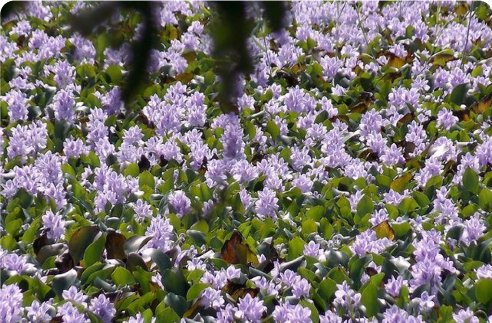
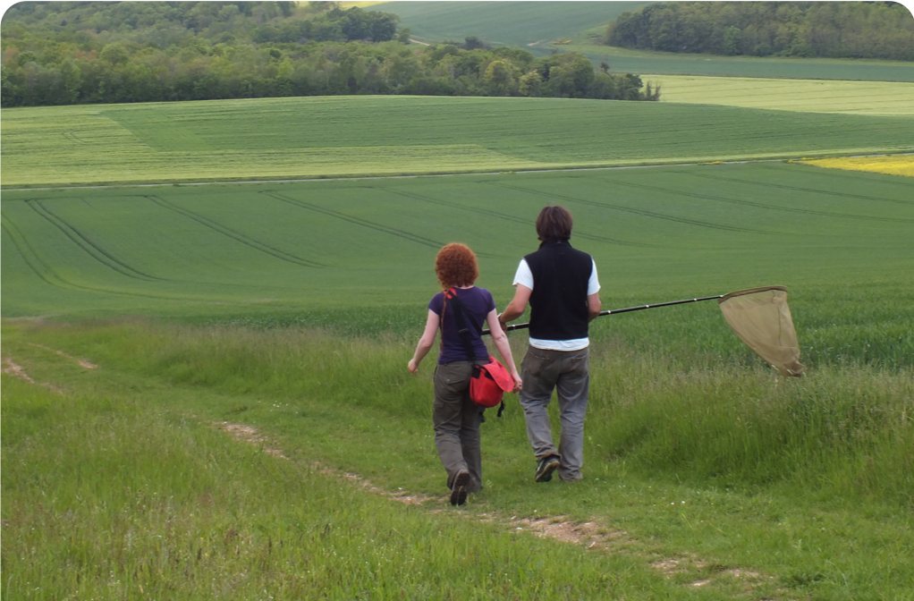
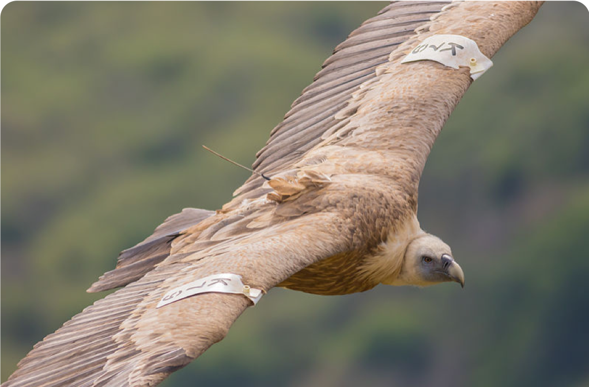
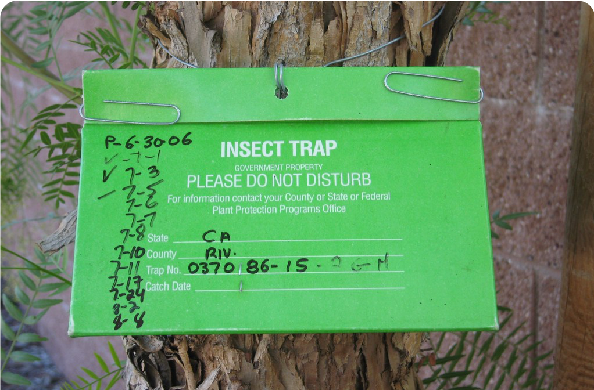
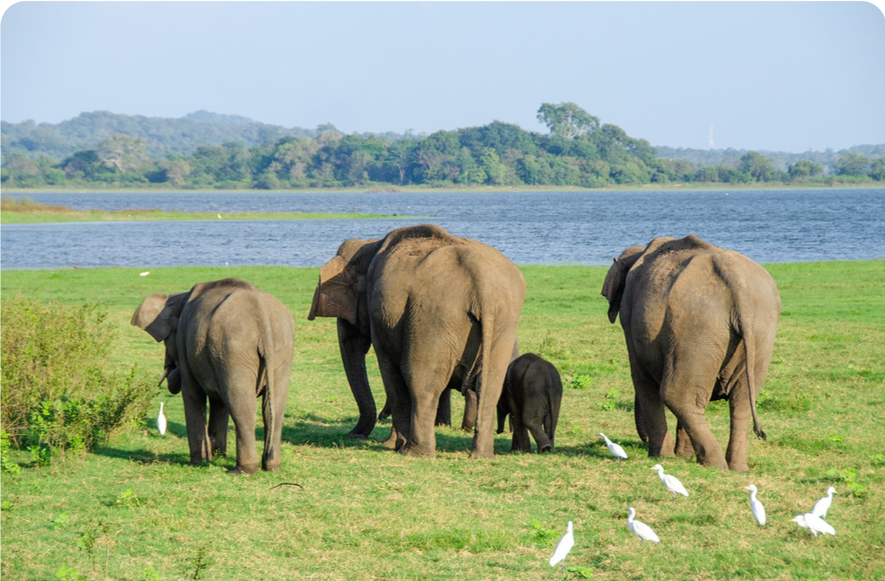
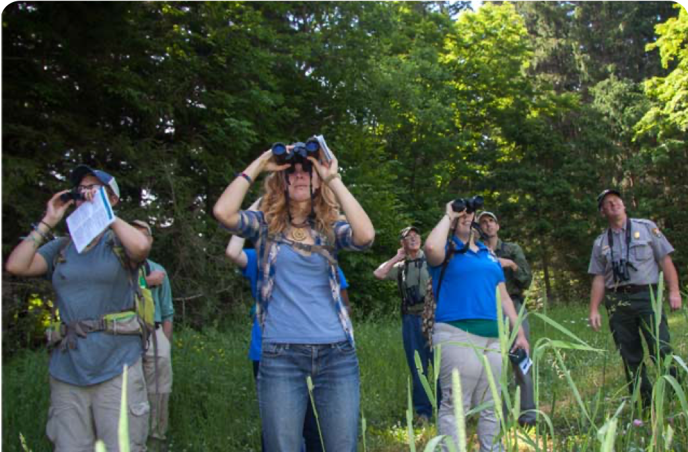
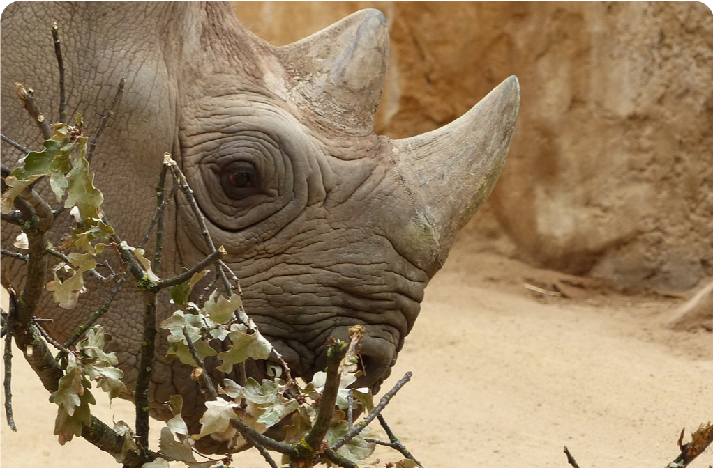

[multipage-level=2]
== Data capture
[NOTE.objectives]
In this module, you will learn about the concept of standards, in particular, the Darwin Core Standard and its components. 
You will also learn the types of primary biodiversity data and how to best share that information within GBIF. 
Lastly, you will review principles of data quality in the context of data capture and will learn about data quality and coherence (especially on subjects such as georeferencing, dates, names and taxa cross-checking).

=== Standards and Darwin Core
[NOTE.presentation]
In this video (15:37), you will learn how you interact with standards every day. 
Then you will be introduced to https://www.tdwg.org/[Biodiversity Information Standards^], including the https://www.tdwg.org/standards/dwc/[Darwin Core Standard^] with which you will continue to use throughout this course.
If you are unable to watch the embedded Vimeo video, you can link:../videos/Foundations_Standards_Darwin_Core.mp4[download^,opts=download] it locally. (MP4 - 27 MB)

video::439983725[vimeo, height=480, width=640, align=center]

=== Data origins and types
[NOTE.presentation]
In this video (10:45), you will review https://www.gbif.org/dataset-classes[primary biodiversity data^] that can be shared within GBIF. 
If you are unable to watch the embedded Vimeo video, you can link:../videos/data_origins_types.mp4[download^,opts=download] it locally. (MP4 - 19 MB)

video::438251559[vimeo, height=480, width=640, align=center]

****
*Questions*

* Is your data type different than you originally thought?
* With what kind of data do you work?
* How would you publish your data to GBIF (using which Core and/or extension)?
****

=== Data capture, processing and quality
[NOTE.presentation]
In this video (09:11), you will explore the principles of data quality applied to data capture, specifically when capturing data from collection labels, fieldwork notebooks, spreadsheets, etc.
If you are unable to watch the embedded Vimeo video, you can link:../videos/Data_capture_processing_quality.mp4[download^,opts=download] it locally. (MP4 - 19 MB)

video::438251371[vimeo, height=480, width=640, align=center]

=== Exercise 2
[NOTE.activity]
For this activity, you will complete an exercise simulating data capture.
You will begin to work with https://dwc.tdwg.org/terms/[Darwin Core terms^] and make decisions on data that is needed for your organization/project and you will consider which of that data will be shared later during publication.

Read <<scenario,USE CASE I>> (if you haven't already).

Imagine that you are the person assigned to transcribe the data found on the herbarium sheets.

. Download link:../exercise-data/UC1-2-base-material.zip[UC1-2-base-material.zip,opts=download]. (34.4 MB).
There are 10 images. Two images per specimen for a total of five specimens. 
The herbarium sheets are in Spanish (data may come to you in various means and in other languages than your own), but you should be able to recognize the data contained in the fields on the labels. 
Remember to use both images per record to compile the information.
. Download the spreadsheet template: link:../exercise-data/UC1-2-occurrence-template.xlsx[UC1-2-occurrence-template.xlsx,opts=download] (57.3 KB) to transcribe the information found on each of the images for the five specimens. 
. Use the previously downloaded exercise sheet to provide your answers.

NOTE: you may need to add fields to the spreadsheet as you may be able to capture more information from the labels that was planned for in the template.

=== Review

[NOTE.quiz]
Quiz yourself on the concepts learned in this section.

****
[question, mc]
....
What dataset type(s) would you choose for an ichthyology collection?

:figure-caption!:
.https://www.gbif.org/occurrence/441867173[Eutrigla gurnardus (Linnaeus, 1758)] | Muséum d’histoire naturelle de Nice
image::img/web/QDataTypes-specimen.png[align="center", width="640", height="360"]

- [x] occurrence
- [x] checklist
- [ ] sampling event
....

[question, mc]
....
What dataset type(s) would you choose for a list of invasive species?

:figure-caption!:
.Water hyacinth (Eichhornia crassipes) observed in Bourail, New Caledonia, where it is an introduced and invasive species by GRIIS. Photo by gérard (2016) licensed under CC BY-SA 2.0

- [x] occurrence
- [x] checklist
- [ ] sampling event
....

[question, mc]
....
What dataset type(s) would you choose for the flora and fauna of an environmental impact study?

Environmental impact assessment studies are done by experts in order to assess the biodiversity and biotopes of a given area, before, during and after it is affected by human activities (road works, wind turbines, mining, building construction, etc.).

:figure-caption!:
.https://upload.wikimedia.org/wikipedia/commons/6/64/Entomologist_chasing_buterflies.jpg[Entomologist chasing butterflies] by Matthieu Gauvain (CC-BY-SA)

- [x] occurrence
- [ ] checklist
- [x] sampling event
....

[question, mc]
....
What dataset type(s) would you choose for bird tracking data?

Bird-tracking data are recorded using specific devices, such as GPS trackers mounted on live birds, thus allowing scientists to track their migratory routes or breeding sites.

:figure-caption!:
.https://commons.wikimedia.org/wiki/File:Griffon_vulture_at_Gamla_nature_reserve.jpg[Griffin vulture] observed at Gamla Nature Reserve by מינוזיג - MinoZig (CC0) 

- [x] occurrence
- [ ] checklist
- [ ] sampling event
....

[question, mc]
....
What dataset type(s) would you choose for insect trap data?

:figure-caption!:
.https://www.flickr.com/photos/miheco/215305679/[Insect trap] by miheco (CC-BY-SA)

- [x] occurrence
- [ ] checklist
- [x] sampling event
....

[question, mc]
....
What dataset type(s) would you choose for national park management data?

Data acquired in the context of protected areas management (such as national parks but also smaller nature reserves) can be diverse and have different origins: botanical surveys, tagged animals tracking, observations from rangers and guards, and even ‘citizen science’ data or data inferred from pictures shared on social medias.

:figure-caption!:
.https://pixabay.com/fr/photos/%C3%A9l%C3%A9phant-%C3%A9l%C3%A9phant-d-asie-4037451/[Sri Lankan elephants] observed by pen_ash.

- [x] occurrence
- [x] checklist
- [x] sampling event
....

[question, mc]
....
What dataset type(s) would you choose for a citizen science bioblitz?

Citizen science data are often collected through thematic fieldwork days known as a “bioblitz.” Volunteers typically gather in a given area and spend the day trying to observe and identify as many species as they can in this area.

Data from each participant are captured and merged into the citizen science programme’s data capture or data management tool.

:figure-caption!:
.https://www.nps.gov/experiences/citizen-scientists-bioblitz.htm?fullweb=1[Looking for birds with park staff] by US National Park Service (authorized reuse on google image search)

- [x] occurrence
- [ ] checklist
- [x] sampling event
....

[question, mc]
....
What dataset type(s) would you choose for a regional species list?

:figure-caption!:
.https://pixabay.com/fr/photos/zoo-de-magdebourg-makibo-2876837/[Black rhino] observed at the Magdeburg Zoo in Germany by Mani300

- [ ] occurrence
- [x] checklist
- [ ] sampling event
....
****
