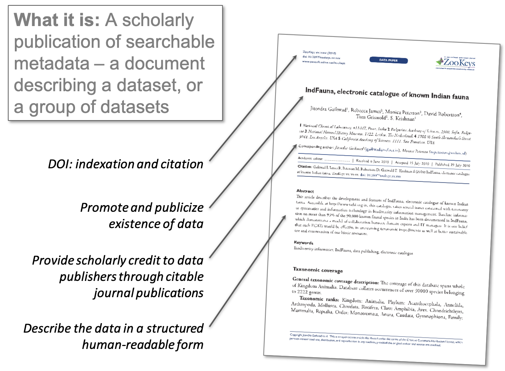
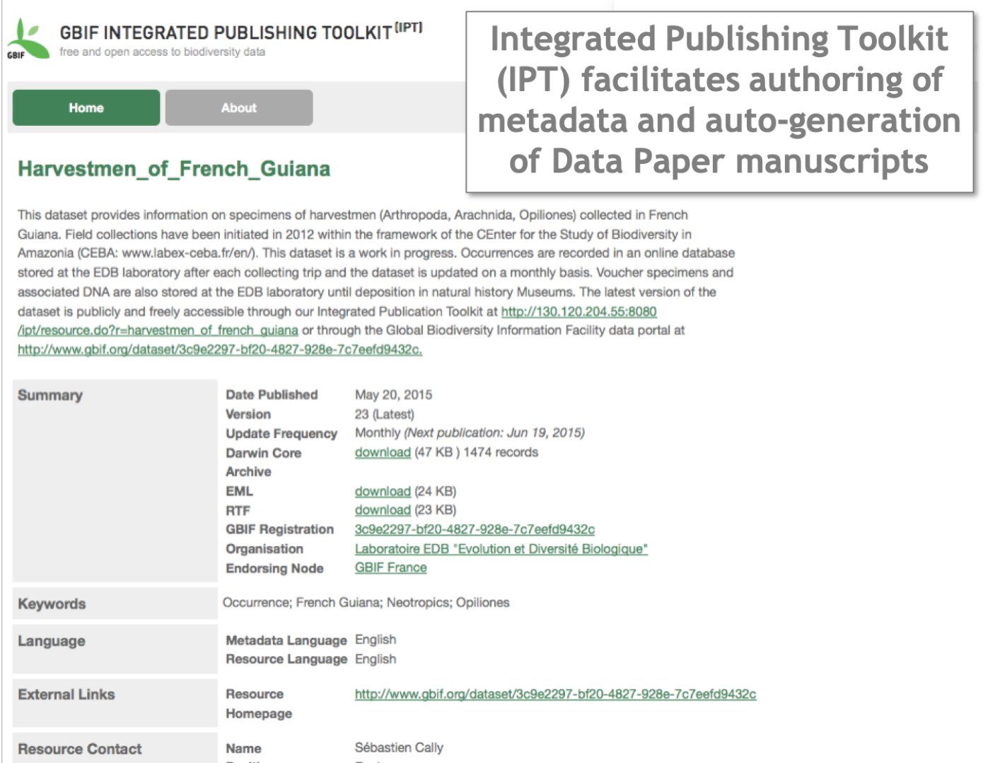

[multipage-level=2]

== Appendix: Data papers

[NOTE.presentation]
A data paper is a peer reviewed document describing a dataset, published in a peer reviewed journal. 
It takes effort to prepare, curate and describe data. 
Data papers provide recognition for this effort by means of a scholarly article.
We do not cover how to create data papers in this course, however, as an optional activity, you can watch this video (51:51) presented by Lizanne Roxburgh. 
In this video, you will learn more about publishing data papers.
If you are unable to watch the embedded Vimeo video, you can link:../videos/Webinar_data_papers.mp4[download,opts=download] it locally. (MP4 - 99.2 MB)

video::265350948[vimeo, height=480, width=640, align=center]

You can read more about data papers on GBIF.org.

====
View the links below to see a data paper as it appears on the IPT, on GBIF.org and in the Journal. Each are cross-linked.

* Journal: https://doi.org/10.3897/BDJ.2.e4244
* GBIF: https://www.gbif.org/dataset/3c9e2297-bf20-4827-928e-7c7eefd9432c
* IPT: http://130.120.204.55:8080/ipt/resource.do?r=harvestmen_of_french_guiana
====
