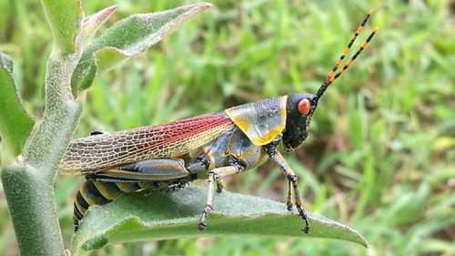

= Biodiversity Data Mobilization Course
GBIF Secretariat <training@gbif.org>
:multipage:
:multipage-level: 1
:toc: left
:toclevels: 3
:numbered:
:revnumber: {git-metadata-sha-short}
:revdate: {git-metadata-date} {git-metadata-time} {git-metadata-timezone}
:title-logo-image: img/web/photo.jpg
:license: https://creativecommons.org/licenses/by-sa/4.0/
:docinfo: shared-head
// :stylesheet: /adoc/gbif-stylesheet/stylesheets/gbif-training.css

ifndef::backend-pdf[]
languageLinks:combined[]
endif::backend-pdf[]

// add cover image to img directory and update filename below
ifndef::backend-pdf[]
:figure-caption!:
._Zonocerus elegans_ (Thunberg, 1815) observed in Zimbabwe by nickypegg (licensed under http://creativecommons.org/licenses/by-nc/4.0/[CC-BY-NC 4.0])

endif::backend-pdf[]

:sectnums!:

include::description.en.adoc[]

include::downloads.en.adoc[]

include::foundations.en.adoc[]

include::use-case-herbarium-specimens.en.adoc[]

include::planning.en.adoc[]

include::capture.en.adoc[]

include::management.en.adoc[]

include::publishing.en.adoc[]

include::assessments-certification.en.adoc[]

include::use-case-invasive-species.en.adoc[]

include::use-case-lepidoptera-sampling.en.adoc[]

include::use-case-birds-from-literature.en.adoc[]

include::assignments.en.adoc[]

include::course-evaluation.en.adoc[]

include::keydocs.en.adoc[]

include::glossary.en.adoc[]

include::data-papers.en.adoc[]

include::solutions.en.adoc[]

include::acknowledgements.en.adoc[]

include::colophon.en.adoc[]
