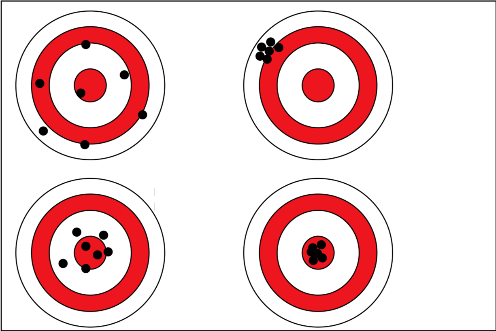

[multipage-level=2]
== Appendix: Solutions

=== Foundations review solutions

*For the given statement, input the correct term (database, database language, database program)*

* combines and presents functions and features for manipulating data, together in a unified interface +
*database program* +
* structured and organized collection of data and/or information held on a computer +
*database* +
* the way by which a human communicates with a computer +
*database language* +

*If you open a data file and see the following, what would you suspect is the issue?*

�tre, ou ne pas �tre, c�est l� la question.

* The wrong encoding was used to open the file

*For the given software, input the type of software (data capture, data management, data cleaning, data publishing).*

* Integrated Publishing Toolkit (IPT) +
*data publishing*
* Specify +
*data capture* AND *data management*
* iNaturalist +
*data capture*
* OpenRefine +
*data cleaning*

*For the given example, input the correct data type (binary, boolean, float, integer, long integer, text, unstructured text)*

* 1236975 +
*long integer*
* 01101111 +
*binary*
* We walked 5 miles down the road west from the post office in the center of town. We then went 2 miles north on a dirt path to the river. Then we continued west along the river for another 5 miles. +
*unstructured text*
* 1024 +
*integer*
* 29.0 +
*float*
* Yes/No +
*boolean*
* 6 rabbits were observed +
*text*

*Which of these terms describes a "field/column name"?*

* Assigned
* Identifying
* Unique

*Which of these terms describes a "field label"?*

* Descriptive
* Readable
* User-interface

*For each statement, input the correct structure (row, column, table)*

* All data refers to a SINGLE concept. +
*table*
* An attribute has the SAME field/data type for every record. +
*column*
* Attributes of a record ALWAYS stay together. +
*row*

*Who determines the fitness for use of your data?*

* The users of the data for research or education

*For the given statements, input the matching image. (A, B, C, D)*

* High accuracy, low precision +
*C*
* Low accuracy, high precision +
*B*
* High accuracy, high precision +
*D*
* Low accuracy, low precision +
*A*

*Identify the data relationships where Dataset B needs to be merged into Dataset A (0:1, 1:0, 1:1, 1:∞, ∞:1, ∞:∞). Not all the relationships used.*

* Collector field exists in both dataset A and B +
*1:1*
* Country field only exists in dataset B +
*0:1*
* Name field exists in dataset A, but dataset B contains First Name and Last Name fields +
*1:∞*
* ID field exists in both dataset A and B +
*1:1*
* Elevation exists in dataset A, but not in dataset B +
*1:0*
* Date exists in dataset A, but Day, Month, and Year are separate fields in dataset B +
*1:∞*

*Metadata is important because (select the TRUE statements)*

* it allows users to determine if a dataset is fit for their use.
* it allows you to know under which legal terms the reuse of data is permitted.

=== Planning review solutions

*What is the order of the five PMBoK Process Groupings?*

* Initiating, Planning, Executing, Monitoring and Controlling, Closing 

Learn More: https://quizlet.com/306742513/1-introduction-pmbok-guide-6th-edition-flash-cards/

*What are the types of deliverable?*

* Stated - YES
* Implied - YES
* Estimated - NO
* Direct - YES
* Indirect - YES
* Guesses - NO

*What is a bottleneck?*

* a blockage that delays development or progress - YES
a space where something or someone is missing - NO, THIS IS A GAP
* a problem, or situation that prevents somebody from doing something, or that makes something impossible. NO, THIS IS A BARRIER

*Which are examples of mobilization tasks?*

* Affiliation - NO, This is a Resource Type
* Publishing - YES
* Imaging - YES
* Georeferencing - YES
* Increased Public Awareness - NO, This is an implied goal.

=== Data capture review solutions

=== Data management review solutions

=== Data publishing review solutions

=== Use Case I suggested solution
