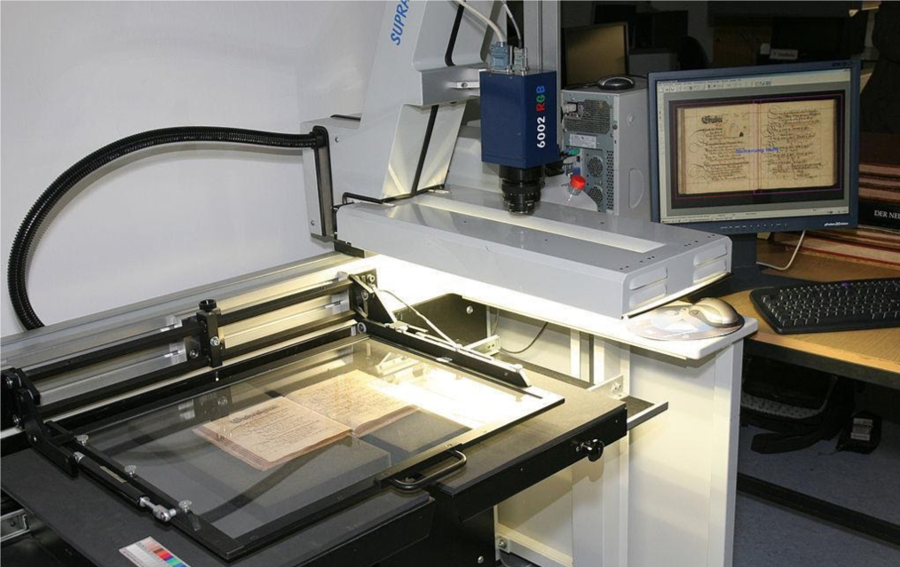
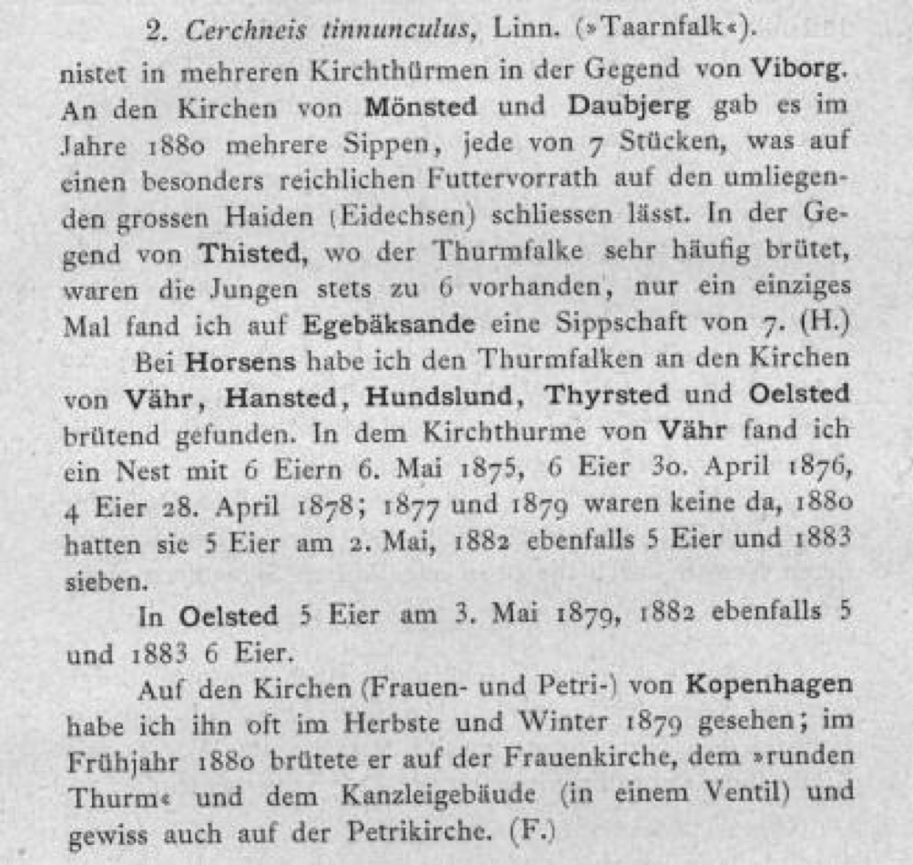

[multipage-level=2]

== Use Case III - Birds from literature
[NOTE.activity]
Familiarize yourself with the use case scenario.

Use Case III will be graded.

=== Scenario
*Data Mobilization Project from Literature “Birds fallen at Danish Lighthouses, 1883–1939”*

:figure-caption!:
.https://upload.wikimedia.org/wikipedia/commons/b/bc/Wikimedia_Rechenbuchdigitalisierung_2006-05-24_01.JPG[High resolution scanner] for book digitisation project by Heiko Hornig (licensed under https://creativecommons.org/licenses/by-sa/2.5/deed.en[CC BY-SA 2.5])

This narrative was developed as a basis for practical exercises in the biodiversity data mobilization course and the exercise concept and content was developed by Alberto González-Talaván, Andrea Hahn, Laura Russell and Sharon Grant. 
It is based upon a previous adaptation by Alberto González-Talaván, Danny Vélez, Larissa Smirnova, Laura Russell, Mélianie Raymond and Nicolas Noé. 

It is a fictionalized scenario based on a real project and dataset and is meant only for instructional purposes. 
The https://danbif.dk/se-eksempler/fyrfaldne-fugle/[original project] and the https://www.gbif.org/dataset/ad331dcc-d0fa-4816-b1e6-d36f9f899c49[original dataset] are attributed to the Danish GBIF Node, https://danbif.dk/[DanBIF].

==== Description

The Natural History Museum of Denmark (NHM-DK) is a research centre associated with the University of Copenhagen. 
Their library is a member of the national library association who recently received state funding to make available online the resources held by its members.
The NHM-DK would like to begin digitization of the field notebooks, journal publications and books held in their library, some of which have significant historic value.

After a short consultation with their regular partners, NHM-DK received a suggestion from the Head of the management office of the Nordjylland National Park. 
They would like the contents of a particular classic literature compilation digitized for a project they are running: ‘Birds at the Danish Lighthouses, 1883–1939’ (In Danish, ‘Fuglene ved de danske Fyr, 1883–1939’). 
They want to use any occurrence data recorded in those books from two lighthouses (Lodbjerg Fyr and Hanstholm Fyr) for an on-site exhibition project.
 
The NHM-DK has started discussions with their national GBIF node, DanBIF, about the mobilization of the information contained in these volumes, namely to preserve their contents for the future and provide online access for everyone.
With the involvement of DanBIF, there is intent to publish and register the resulting extracted data with GBIF.
As GBIF requires a license be applied with all published data, the museum has decided to publish the data with a Creative Commons license allowing use of data with attribution (CC-BY).

The IT services required are provided by the Technology Unit of the University of Copenhagen, as for all museum digital projects. 

The HHM-DK deputy director, who is coordinating this piece of work has developed a general outline for the work:

. The museum will carry out the digitization of the literature using two library staff members trained in the use of the library scanner to scan delicate volumes.
They will also extract text from the scans through OCR (Optical Character Recognition) software.
. Three volunteers from the Copenhagen Ornithological Society (COS) who regularly collaborate with the museum and are familiar with the birds of the region have been enlisted to assist and will complete the transfer of data from the scanned PDFs into spreadsheet format.
They will need to go to the museum and use the computers available in the library to gain access to the files stored in the museum intranet (private network).
. The Ornithology Curator in the Bird Department will lead the team responsible for taxonomic checking, data curation, cleaning, format and transformation, and will oversee the entry of metadata for the published dataset.
The team includes a collaborating researcher from Sweden, and two postdoctoral students.
They have been selected for this task because they are used to working with digital biodiversity data.
They will all use their own work computers. 
. The DanBIF Node Manager will ensure that the institution is adequately registered in GBIF as a data publisher and that the deputy director and the ornithology curator have the proper credentials and access to DanBIF’s IPT instance to upload and publish the data.

==== Orignal data collection

In the period 1883-1939, there were 45 lighthouses and lightships functioning in Denmark.
These lighthouses were used by several species of birds during the nights of the bird migration period from the years 1886 through 1939.
The presence and activities of these birds were recorded, especially by the keepers of these lighthouses who also collected specimens that were sent to the museum in Copenhagen.
These birds were carefully preserved and catalogued by collection managers at the museum and the specimens can still be found there today.
Observations of weather conditions during the nights when birds were observed by the keepers were also documented.

==== Analogue data description

This is an example of the description of a series of species observations from one of the books (in German, except the common name for the species which is provided in Danish).

==== Scanned and translated data description

This is an example of the scanned and translated output from the analogue example above.

image::img/web/use-case-3-scanned.png[align="center", width="640", height="360"]

==== Digital data description

Studying the extract from the book, the volunteers from the Copenhagen Ornithology Society suggest extracting the following data from the scanned and translated text:

* Scientific name as appearing in the book
* Common name(s) in Danish as appearing in the book
* Locality
* Year/month/day
* Observed number of individuals
* Sex
* Lifestage
* Remarks
* URL of the digitized book page in which the occurrence is provided

=== Exercise 1

*Planning*

The team needs to develop a sustainable workflow to digitize literature resources, extract any valuable biodiversity information on them and publish it online via GBIF.
They need to develop a plan that can be sustained in the future once the funding from the national library association is over.
 
The scenarion section of this use case includes a brief description of the workflow conceived by the deputy director.
Based on the workflow and the accompanying text complete the following:

. Identify the different stakeholders participating in this project
. Identify their affiliation and assign each of them to a stakeholder group
. Identify the roles associated to them and assign the tasks for which they are currently responsible
. Perform a critical analysis of the workflow, identify potential risks and gaps, and suggest ways to improve the workflow, maximize the efficiency of the digitization project and produce data of the highest quality possible. 
. Use the exercise sheet to provide your answers.

=== Exercise 2

*Data capture*

The scans and character recognition (OCR) of the books have been completed.
Occurrence data must now be extracted from those sources and compiled in a spreadsheet format. 

The original data was in German and, to make it more widely useable when published online, the project manager would like to make it available in English.

....
2. Cerchneis tinnunculus, Linn. ( "Taarnfalk") nests in several steeples around Viborg.
 
At the churches of Mönsted and Daubjerg there were several family groups in 1880, each of 7 individuals, suggesting a particularly abundant source of food on the surrounding heather (lizards). In the area of Thisted, where the tower falcon broods very often, young were always present in broods of 6, only once did I find a group of 7 on Egebäksande (H.)

In Horsens I found kestrels brooding on the churches of Vähr, Hansted, Hundslund, Thyrsted and Oelsted. In the steeple of Vähr I found a nest with 6 eggs on 6 May 1875, 6 eggs on 30 April 1876, 4 eggs on 28 April 1878; in 1877 and 1879 there were none, on 2 May 1880 they had 5 eggs, in 1882 also 5 eggs, and in 1883 seven.

In Oelsted 5 eggs on 3 May 1879, in 1882 also 5, and in 1883 6 eggs.

On the churches (Our Lady’s and St. Peter’s) of Copenhagen, I have often seen it in the autumn and winter of 1879; in spring 1880, it brooded on Our Lady’s church, the "round tower" and the law firm building (in a valve) and certainly also on St. Peter's Church. (F.)
....

. Take the role of a volunteer charged with transforming the translated text into a spreadsheet as individual occurrences. The occurrences will need unique numbers assigned to them.  
. Create a sample spreadsheet using the data fields listed in the https://docs.gbif-uat.org/course-data-mobilization/en/scenario-4.html#digital-data-description-3[Digital Data Description] using data found in the example above recorded by: Chr. Fr. Lütken. 
. Document your work using the exercise sheet.

TIP: In the examples used, the individual occurrences do not always contain data to complete all of the columns in the spreadsheet.

=== Exercise 3

*Data management*

Data has now been compiled into a spreadsheet format by the volunteers from the Copenhagen Ornithological Society.
Taking the role of the Ornithology Curator in the Bird Department, you have been assigned the responsibility for data quality issues on the dataset.

Through retrospective georeferencing, coordinates have been added to the dataset along with the locality, but no other higher geography.
Since all the observations were made in Denmark, continent and country can easily be added.
Additionally, only the scientific name was provided.
Higher taxonomy can be derived utilizing software tools such as OpenRefine.
You are also aware that there are typographic errors that were made by the digitizers.

. Download USE CASE 3 DL - Data File Cleaning
. Identify and correct any invalid years
. Verify and correct taxonomy
. Verify coordinates are correct for the two given localities.
Correct any that are not.
Coordinates should be in decimal format.
. Add any data for missing elements that can be derived using the available data
. Remember to keep the original information provided and document your changes and assumptions as part of the individual records and the metadata.

TIP: dataset should contain only years 1883-1939

=== Exercise 4

*Data publishing*

For this exercise, you will take the role of the person responsible for publishing the cleaned data online via the GBIF network.
You have been supplied with a multimedia file and an identification history file that should be published along with the observations.
The staff member in charge of data quality has provided cleaned datasets for you to publish.

. Download USE CASE 3 DL - Data Files Publishing from the elearning platform
. Use the exercise sheet to describe the steps you would perform to publish this dataset. 
. Use the previously provided IPT installation to publish the given dataset.

=== Exercise sheet

Download (MS Word, ?? MB)
