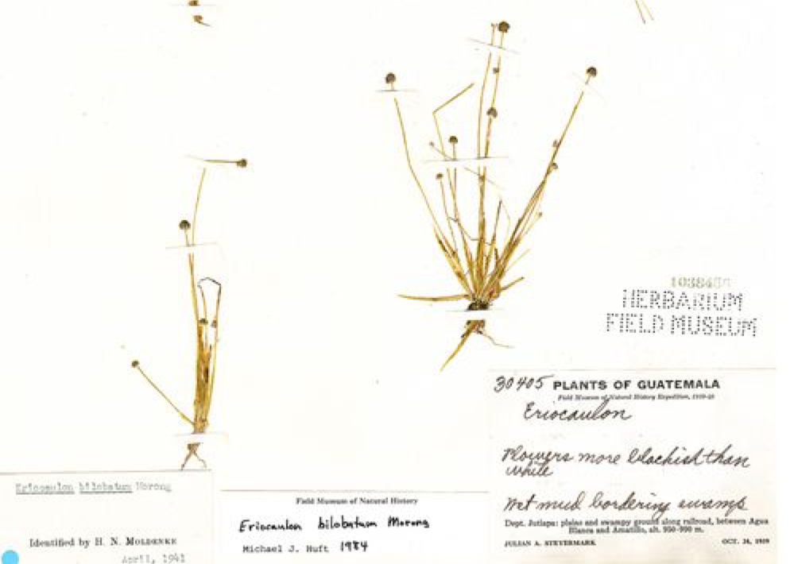
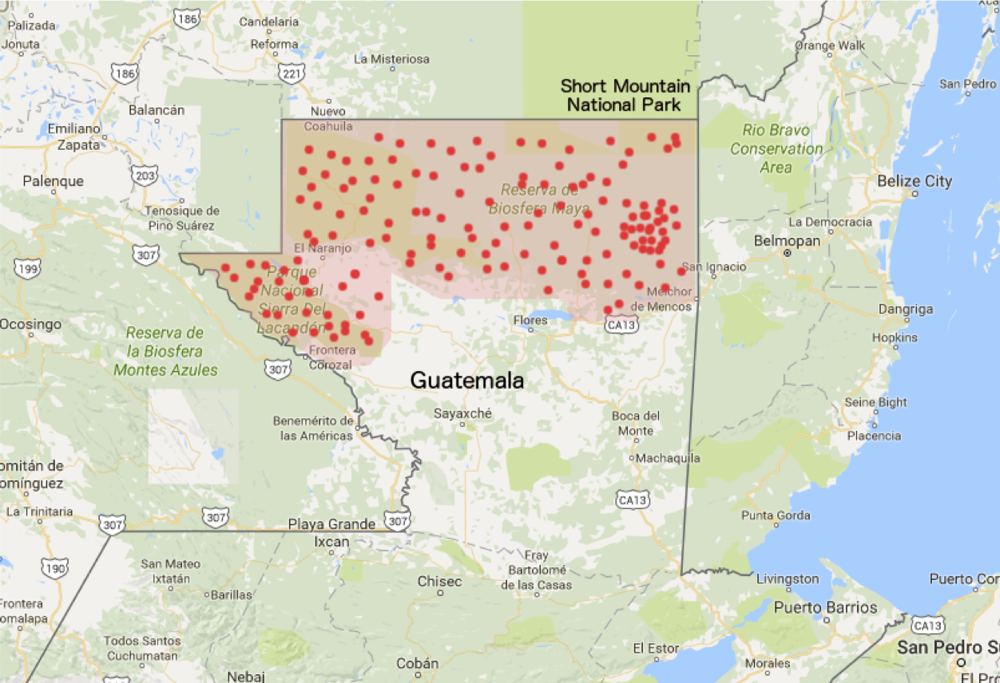

[multipage-level=2]

== Use Case I - Herbarium Specimens
[NOTE.activity]
Familiarize yourself with the use case scenario.

Use Case I is a practice use case for the planning, data capture, data management and data publishing modules.
It is recommended that you download the link:../course-docs/UC1-Herbarium-Exercise_EN.docx[exercise sheet,opts=download] (MS Word 345 KB) so that you can make notes as you work through the exercises. 
A suggested solution will be provided in the solution appendix. 
Use Case I is not graded.

=== Scenario
*A Data Mobilization Project in a Regional Herbarium*

:figure-caption!:
.https://www.gbif.org/occurrence/1228493621[Eriocaulon bilobatum Morong] collected in Guatemala by Rapid Reference Collection (RRC) | Field Museum of Natural History - Keller Action Science Center (licensed under http://creativecommons.org/licenses/by-nc/4.0/[CC-BY-NC 4.0])

This narrative was developed as a basis for practical exercises in the biodiversity data mobilization course and the exercise concept and content was developed by Alberto González-Talaván, Néstor Beltrán, Nicolas Noé, Sharon Grant. The data are from a real dataset, but have been modified for the purposes of these exercises. It is a fictionalized scenario and is meant only for instructional purposes.

==== Description
The University of White Plains is a well recognized tertiary education institution in Guatemala and a national reference for biodiversity research. 
The Plant Biology Department keeps a medium-size herbarium containing approximately 80,000 specimens collected in and around the local region and dating from the mid-20th century to the present. 
The collection includes important specimens including types and endemics.

Currently, the care of the collection is assigned to the Professor of Plant Systematics, who performs curatorial tasks as well as their regular research and teaching work. 
The Departmental Admin is responsible for day-to-day administrative tasks for the herbarium such as purchasing consumables including paper and labels. 
Faculty staff and students collaborating within the department occasionally work on and update the identifications on the specimens and there are two retired botanists who regularly volunteer in the collection assisting the Professor to prepare loans.

The University already has an online search for its library collections which is maintained by the University’s central web-team on externally hosted servers. 
No natural history specimens are currently served via this platform.

The Head of the Plant Biology Department has recently secured a 50,000USD, two year grant to image and publish the botanical collections information online. 
The team wants to use this opportunity to establish a permanent digitization and publishing protocol that will give higher visibility to the herbarium and continue attracting funding.

==== Data collection

The herbarium comprises approximately 80,000 specimens collected from 1960 to 2015 concentrated mainly in the biodiversity hot spot -- Short Mountain National Park. 
The collection is still growing as a result of exchanges, donations and several active research projects. 
For each specimen, information about collector, time, date, location and taxonomy are documented. 
So far no quality control measures have been carried out on the data and there has been no systematic imaging of specimens.

==== Dataset description
The professor has a simple non-relational database on his computer which serves as an index of many but not all specimens. 
Any images of the specimens that exist are held locally by the individual researchers that took them.

=== Exercises

The individual exercises for this use case are located in the corresponding modules.

==== Planning

<<Exercise 1a-c>>

==== Data capture

<<Exercise 2>>

==== Data management

<<Exercise 3a-c>>

==== Data publishing

<<Exercise 4>>

=== Exercise sheet

link:../course-docs/UC1-Herbarium-Exercise_EN.docx[UC1-Herbarium-Exercise_EN.docx,opts=download] (MS Word 345 KB)
