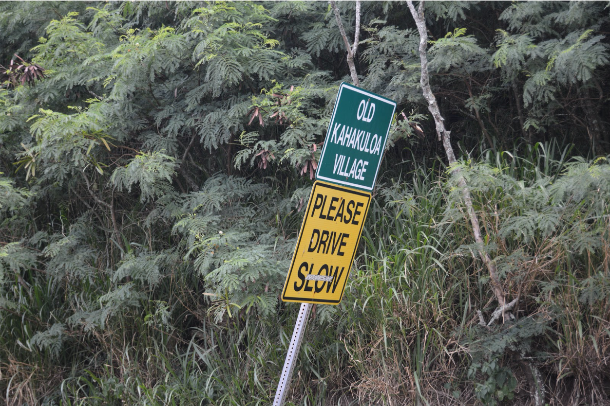
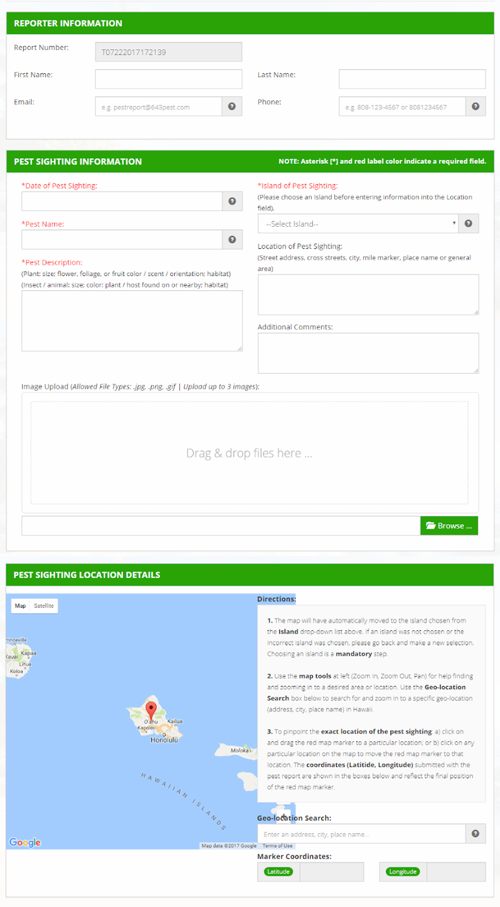

[multipage-level=2]

== Use Case II - Invasive species
[NOTE.activity]
Familiarize yourself with the use case scenario.

You have a choice for Use Case II between two scenarios:

* Invasive species checklist
* Lepidoptera sampling

Your choice for Use Case II will be graded.

=== Scenario
*Tracking invasive species*

:figure-caption!:
.Acacia melanoxylon or Acacia koa? observed in Hawaii by Sharon Grant (licensed under http://creativecommons.org/licenses/by-nc/4.0/[CC-BY-NC 4.0])

This narrative was developed as a basis for practical exercises in the capacity enhancement workshop on biodiversity data mobilization.
Please note that this use case is a fictitious scenario and is only for instructional purposes.

==== Description
The Hawaii Invasive Species Council (HISC) received a federal grant to collaborate with high schools as part of Hawaii’s statewide curriculum on Invasive Species to increase local knowledge about invasive species, increase data collection and produce annotated checklists for under reported areas. 
A full-time Project Manager is employed to oversee the project. 
All funds and allocations are managed by the HISC Fiscal Associate.

The Manager of each island’s Invasive Species Committee (ISC) received a sub-award to set up local education programs and collect data. 
The programs trained high school students to become Student Mentors and to facilitate image and data collection by members of the local community. 
The Big Island Invasive Species Committee (BIISC) received a further sub-award to extend their central database to accommodate each ISC’s data, provide participating schools with their own websites, and maintain a single, searchable data portal to serve government, public, and scholarly research efforts.

Two schools on each island were selected because they were located in areas where knowledge and documentation of invasive species assessment was poor or non-existent.
Teachers worked with their local Invasive Species Council (ISC) Outreach Associate to create teaching materials detailing 21 important invasive plant species, including how to identify each species’ life stages and the most effective control methods.

The Graduate School of the University of Hawaii in Maui (UHM) runs a course in community outreach.
Four botany students from the University, as a part of their final course assessment, are validating the identifications from the images and descriptions submitted by each high school to their local ISC.

==== Data collection

Students from each high school organized a series of day-long community surveys in their local neighbourhoods.
Participants, guided by local ISC Early Detection Technicians and Student Mentors, visited various locations where they were given photo guides and assigned a route to follow during collection events.
Along each route, they were tasked with identifying the target species and taking 1-3 photos of them using GPS-enabled mobile phones. 

Details, describing every observation of the 21 invasive species of interest, were recorded using a digital data collection form during each community collection event.
Participants uploaded the images captured on mobile phones and were encouraged to click their locations using a Google map, embedded in the form, to assign latitude and longitude to each observation.
The form’s design was based on the HISC pest reporting form.

==== Digital data description
A database, created and hosted by the Computing Department at UHM, holds the imagery and data from the online form, but these data are not accessible publicly. 
Data were exported as comma separated value (.csv) files and given to the four UHM graduate students for taxonomic validation using the images and descriptions submitted.
The BIISC GIS Analyst used the Google Maps coordinates and image EXIF data to check observations for quality and to add any missing georeferences.
Student mentors renamed all image files to match the observation number for cross referencing later at BIISC.

=== Exercise 1

*Planning*

You are the local ISC Manager and, because of the success of the lesson plans and community surveys, 10 more schools on your island would like to set up their own projects the following year.
You would like to accommodate them, but your ISC funding will expire at the end of this year.
HISC has indicated that they will look favourably on a small grant application to expand your programs in the following year and BIISC has offered support.

==== Exercise 1a

*Analyze the financial implications of expanding the number of schools*

Evaluate the following options to expand the number of participating schools.
You can only select TWO of these options, so you need to choose wisely. 
Use the exercise sheet to propose the two options you selected and explain why you chose them.
. Pay extra summer interns to work at the local ISC to coordinate surveys .
. Offer financial support to BIISC to set up websites for each new school. 
. Offer financial compensation to the graduate students.
You will not be able to pay all four of them the equivalent of a regular salary, but could cover the costs of part time positions for two of them.
. Contract a software company to build a database that can automatically ingest data directly from the online form.
The system will include an admin interface to allow data manipulation and csv exports. 
. Fund four public outreach activities (e.g., a BioBlitz) to promote awareness in the communities and increase volunteer participation.
. Prepare and carry out a reusable training a course for the teachers at the schools to teach them how to prepare data for submission to BIISC. 

==== Exercise 1b

*Assign roles*

The new project has the following people available for data processing and mobilization.
How would you assign roles to maximize the efficiency of the data processing and transformation to produce data of the highest quality as efficiently as possible? 
Please use the exercise sheet to provide your answers.

* BIISC GIS Analyst: Advanced computer use, GIS and data analysis tools.
* ISC Manager: Good computer skills.
* ISC Outreach Associate: Good field identification skills; Basic computer use. Social media expert.
* Student Mentor 1: Basic taxonomic knowledge. Basic computer use.
* Student Mentor 2: Basic taxonomic knowledge. Basic computer use.
* Botany Student 1: Advanced taxonomic knowledge. Programming skills.
* Botany Student 2: Advanced taxonomic knowledge. 
* Botany Student 3: Advanced taxonomic knowledge. 
* Botany student 4: Advanced taxonomic knowledge.

=== Exercise 2

*Data capture*

The BIISC is now planning to make all of the data from the project publicly available by publishing datasets to GBIF.
As the BIISC’s Outreach Assistant, you must identify the relevant Darwin Core fields to accommodate the data from the online form.
You’ve noticed that additional data describing species and locations have been added to the data form by the graduate students performing validations.
To accommodate this data, you need to extend the data structure to aggregate the data from the online form with the added taxonomy and georeferences.

. Download ‘USE CASE 2 - BIISCoccurrence.csv’
. Using the downloaded dataset, produce a spreadsheet as example of the extended data structure and the fields you’ve identified as relevant for Darwin Core.
. Use the exercise sheet to explain your answers.

=== Exercise 3

*Data management*

Over the summer, interns at the HISC main office created checklists from the original occurrence data that were collected and augmented from the online form.
Taking the role of the HSC Project Leader, you must now carry out final quality checks prior to publication.

. Download ‘USE CASE 2 - BIISCChecklistPrecheckedFilledUnclean’
. Evaluate the dataset and identify which types of errors are present. 
. Identify possible ways to correct those issues and perform those corrections for as many of the errors as you can. 
. Use the exercise sheet to explain your answers and submit the cleaned dataset.

=== Exercise 4

*Data publishing*

The HISC is now ready to publish the checklist data and associated occurrences to GBIF.
For this exercise, you will take the role of the Project Leader.
Your responsibility: publishing the cleaned checklist data and associated occurences online through the GBIF network.

. Download USE CASE 2 - BIISCChecklistPrecheckedFilledCleanForPublication
. Use the exercise sheet to describe the steps you would perform to publish this dataset.  
. Use the previously provided IPT installation to publish the given dataset.

==== Exercise sheet

Download (MS Word, ?? MB)

==== Special acknowledgement
Exercise concept and content developed by Sharon Grant, John Wieczorek, David Bloom and Laura Russell. For reference this use case is a fictionalized story based on a https://doi.org/10.15468/hp7zwr[real dataset]. 

Simpson A (2016). Big Island Invasive Species Committee - Pest Reports - 2005-2010. Version 4.1. 
United States Geological Survey. 
Occurrence Dataset https://doi.org/10.15468/hp7zwr accessed via GBIF.org on 2017-07-13.
