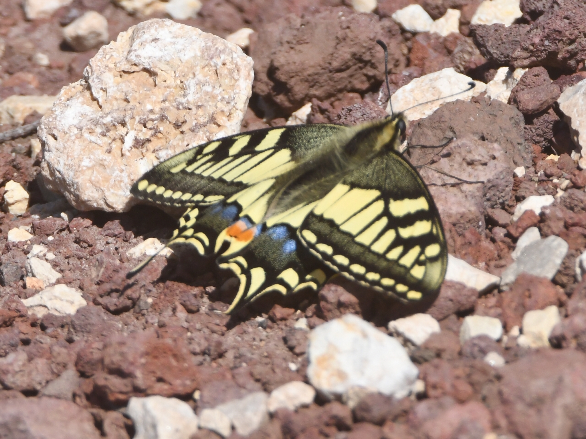
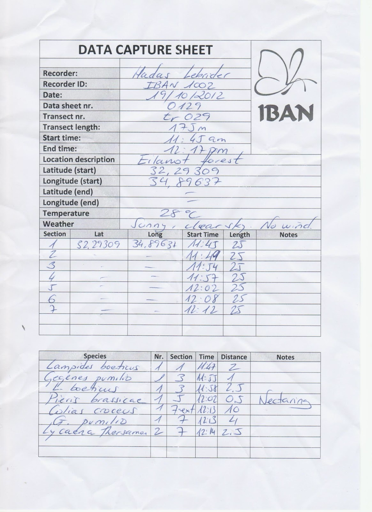
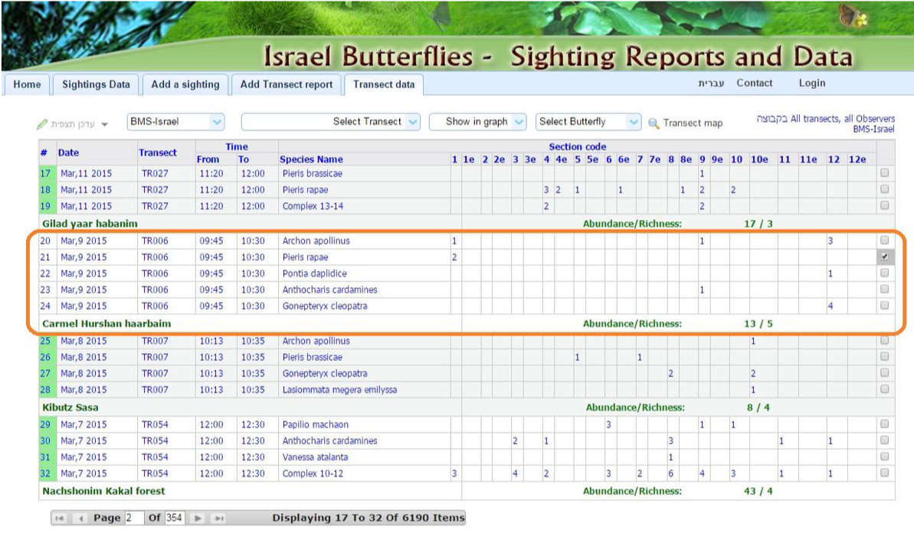
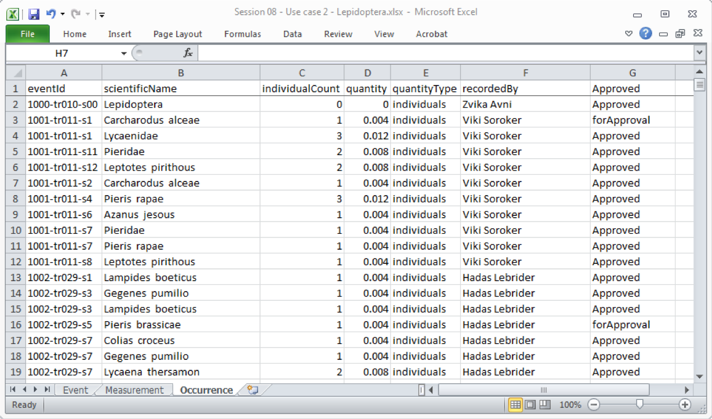

[multipage-level=2]

== Use Case II - Lepidoptera sightings
[NOTE.activity]
Familiarize yourself with the use case scenario.

You have a choice for Use Case II between two scenarios:

* Invasive species checklist
* Lepidoptera sampling

Your choice for Use Case II will be graded.

=== Scenario
*Sampling of Lepidoptera across Countries*

:figure-caption!:
.https://www.gbif.org/occurrence/3039469018[Papilio machaon Linnaeus, 1758] observed in Israel by עומר וינר (licensed under http://creativecommons.org/licenses/by-nc/4.0/[CC-BY-NC 4.0])

This narrative was developed as a basis for practical exercises in the biodiversity data mobilization course and the exercise concept and content was developed by Alberto González-Talaván, based on previous work by Alberto González-Talaván, Danny Vélez, Larissa Smirnova, Laura Russell, Mélianie Raymond and Nicolas Noé.
It is a fictionalized scenario and is meant only for instructional purposes.

==== Description
The International Butterfly Amateur Network (IBAN) has been providing a framework for national amateur observational groups to capture data about the occurrence of butterflies (Lepidoptera) since 2009.
An extensive network of amateur observers use a standard protocol based on Pollard walks to capture this information on paper sheets that they send to their national office.
Some of these offices digitize this information into spreadsheets, but others do not have the human resources to do this and they send the paper logs to the IBAN for processing.
IBAN produces an annual report based on the sightings provided by these national members, with updated distribution maps and analysis of population trends for some key species.

The IBAN headquarters is mainly staffed with volunteers.
With the increasing popularity of citizen science and the general interest in butterflies as a charismatic group of organisms, more and more data are received every year and the paper data sheets quickly pile up undigitized.
The IBAN steering committee is trying to identify a more efficient and agile workflow for the creation of digital data because they would like to start publishing these data online regularly.
They would also like to start processing digital pictures that their volunteers are already capturing with mobile devices like phones and tablets.
Their ultimate objective is to raise the profile of the network and strengthen collaborations with local and regional governments to influence conservation policies for lepidoptera in the countries involved.

There is currently no formal agreement between IBAN and the amateurs capturing data, to cover the ways in which the data can be used, for example.
The steering committee has some concerns that when they start publishing the data online, they will have to formalize this arrangement.

==== Data collection

The recommended protocol —Pollard walks— is based on transects that range between 300 and 600 m in length, divided into 50 m sections.
Each transect should cover a single habitat type.

In each visit, transect-walkers have to count all species of lepidoptera that can be seen within 5 m of the transect line.
Special behaviours (egg laying or nectaring), as well as developmental stage (e.g., larvae or eggs), should be recorded as well.

For most countries, these sampling efforts happen once every two weeks from the beginning of October to the end of June.

There are quality control measures in place: every reported record is flagged "Pending approval".
Record status is only changed to "Approved" after verification by a designated taxonomic expert.
Species spotted out of their regular season or distribution area are flagged for additional verification.

Time of day and weather conditions are recorded at the beginning of the transect.
Along the transect, the number of individuals of every species seen is counted.
Un-identified species are counted and recorded either by family or as a predefined complex of two or three similar species.
Butterflies seen outside the 5 meter range are recorded as “Extra+the number of the nearest section” (e.g. 5-extra).
The end time of the transect is also recorded.

==== Analogue data capture example

==== Digital data description

Some national offices use groups of volunteers to digitize the paper logs and produce digital spreadsheets. 
The spreadsheets are very simple and include three datasheets. 
One captures the information linked to the sampling efforts, the second the weather conditions and the third the species encountered and the number of individuals observed by the amateur.

=== Exercise 1

*Planning*

You are the local ISC Manager and, because of the success of the lesson plans and community surveys, 10 more schools on your island would like to set up their own projects the following year.
You would like to accommodate them, but your ISC funding will expire at the end of this year.
HISC has indicated that they will look favourably on a small grant application to expand your programs in the following year and BIISC has offered support.

==== Exercise 1a

*Analyze the financial implications of expanding the number of schools*

. Evaluate the following options to expand the number of participating schools.
You can only select TWO of these options, so you need to choose wisely. 
. Use the exercise sheet to provide your answers.

*Options*

. Pay extra summer interns to work at the local ISC to coordinate surveys .
. Offer financial support to BIISC to set up websites for each new school. 
. Offer financial compensation to the graduate students.
You will not be able to pay all four of them the equivalent of a regular salary, but could cover the costs of part time positions for two of them.
. Contract a software company to build a database that can automatically ingest data directly from the online form.
The system will include an admin interface to allow data manipulation and csv exports. 
. Fund four public outreach activities (e.g., a BioBlitz) to promote awareness in the communities and increase volunteer participation.
. Prepare and carry out a reusable training a course for the teachers at the schools to teach them how to prepare data for submission to BIISC. 

==== Exercise 1b

*Assign roles*

The new project has the following people available for data processing and mobilization.

. Assign roles to maximize the efficiency of the data processing and transformation to produce data of the highest quality as efficiently as possible. 
. Use the exercise sheet to provide your answers.

*Roles*

* BIISC GIS Analyst: Advanced computer use, GIS and data analysis tools.
* ISC Manager: Good computer skills.
* ISC Outreach Associate: Good field identification skills; Basic computer use. Social media expert.
* Student Mentor 1: Basic taxonomic knowledge. Basic computer use.
* Student Mentor 2: Basic taxonomic knowledge. Basic computer use.
* Botany Student 1: Advanced taxonomic knowledge. Programming skills.
* Botany Student 2: Advanced taxonomic knowledge. 
* Botany Student 3: Advanced taxonomic knowledge. 
* Botany student 4: Advanced taxonomic knowledge.

=== Exercise 2

*Data capture*

Imagine you are one of the volunteers digitizing the paper logs received at the IBAN headquarters. You have received two paper logs.

. Download log 1 ‘Use Case 2 LS - Exercise 2 - Example 1.jpg’
. Download log 2 ‘Use Case 2 LS - Exercise 2 - Example 2.pdf
. What data structure would you use to reflect the data in these logs?
. Create a spreadsheet using this structure and the data from the logs.
. Use the exercise sheet to provide your answers and submit the spreadsheet.

=== Exercise 3

*Data management*

Taking the role of one of the volunteers with advanced computer skills, imagine you have been assigned the responsibility for data quality issues.
Your main task is to reduce the amount of data that is currently discarded (around a 15%) before processing due to errors and inconsistencies.
You have received a dataset as the raw product of the digitization effort.

. Download ‘Use Case 2 LS - Exercise 3 - For Cleaning.xlsx’
. Evaluate the dataset and identify which types of errors are present. 
. Identify possible ways to correct those issues, and perform those corrections for as many of the errors present as you can. 
. Use the exercise sheet to provide your answers and submit the spreadsheet.

=== Exercise 4

*Data publishing*

For this exercise, you will take the role of the taxonomic expert collaborating with IBAN at their headquarters.
Some of your previous responsibilities (writing the annual report, and producing the base distribution maps) have been handed over to the volunteers, and you have now been given a new responsibility: publishing the cleaned data online through the GBIF network.
The volunteer in charge of data quality has provided a dataset to be published.

. Download ‘Use Case 2 LS - Exercise 4 - cleaned for publishing.xlsx’ 
. Use the previously provided IPT installation to publish the given dataset.
. Use the exercise sheet to provide your answers and link to the published dataset.

=== Exercise sheet

Download (MS Word, ?? MB)
